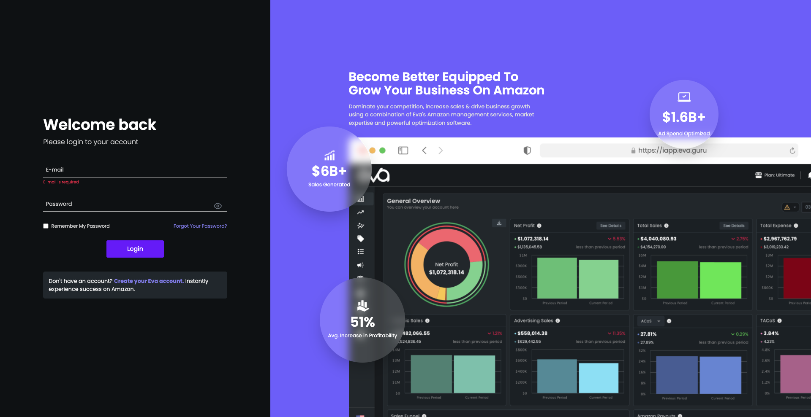
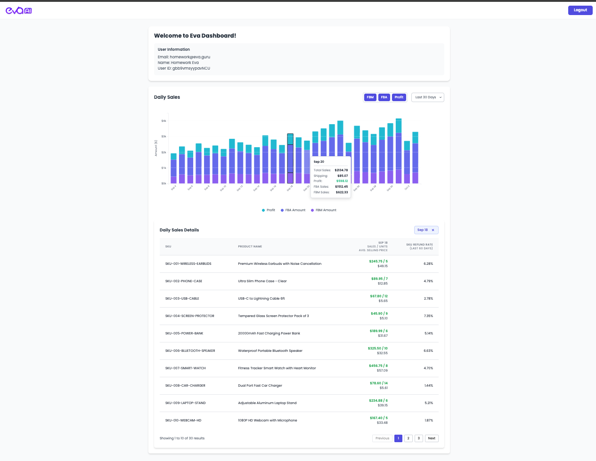

<div align="center">

# 📊 EVA Case Study - Sales Dashboard

### A modern, enterprise-grade sales analytics platform built with cutting-edge technologies

[](https://eva-case-study-taupe.vercel.app/)
[](https://vuejs.org/)
[](https://www.typescriptlang.org/)
[](https://vitejs.dev/)
[](https://vitest.dev/)

**[🚀 View Live Demo](https://eva-case-study-taupe.vercel.app/)** | **[📖 Documentation](#-features)** | **[🧪 Test Reports](#-test-coverage)**

</div>

---

## 🖼️ Screenshots

<div align="center">
  
  <br/><br/>
  
</div>

---

## ✨ Features

### 🔐 **Authentication & Security**
- ✅ Secure token-based authentication system
- ✅ Persistent login with localStorage
- ✅ Protected routes with navigation guards
- ✅ Automatic session management

### 📈 **Advanced Analytics Dashboard**
- ✅ **Interactive D3.js Charts**
  - Real-time data visualization
  - Stacked bar charts with smooth animations
  - Hover tooltips with detailed metrics
  - Click-to-select date ranges

- ✅ **Flexible Time Periods**
  - Last 7 Days
  - Last 14 Days
  - Last 30 Days
  - Last 60 Days

- ✅ **Metric Filtering**
  - FBA (Fulfillment by Amazon)
  - FBM (Fulfillment by Merchant)
  - Profit Analysis
  - Toggle multiple metrics simultaneously

- ✅ **Date Comparison**
  - Select up to 2 dates for comparison
  - Side-by-side SKU performance analysis
  - Percentage change calculations

### 📦 **SKU Management**
- ✅ Comprehensive product listings
- ✅ Real-time data fetching
- ✅ Pagination support (10 items per page)
- ✅ Refund rate tracking
- ✅ Sales performance metrics

### 🎨 **User Experience**
- ✅ Fully responsive design (mobile, tablet, desktop)
- ✅ Modern Tailwind CSS styling
- ✅ Loading states and spinners
- ✅ Error handling with user feedback
- ✅ Smooth animations and transitions

### ⚡ **Performance & Quality**
- ✅ Type-safe with TypeScript
- ✅ 90.1% test coverage
- ✅ Centralized state management (Vuex)
- ✅ Optimized build with Vite
- ✅ Code quality enforced with ESLint & Prettier

---

## 🛠️ Tech Stack

<div align="center">

| Category | Technologies |
|----------|-------------|
| **Frontend** |   |
| **State Management** |  |
| **Data Visualization** |  |
| **Styling** |  |
| **Build Tool** |  |
| **Testing** |   |
| **Code Quality** |   |

</div>

---

## 🧪 Test Coverage

<div align="center">

### **90.1% Overall Coverage** 🎯

| Metric | Coverage | Status |
|--------|----------|--------|
| **Statements** | 90.1% (829/920) | 🟢 Excellent |
| **Branches** | 80.79% (122/151) | 🟢 Very Good |
| **Functions** | 88.46% (23/26) | 🟢 Very Good |
| **Lines** | 90.1% (829/920) | 🟢 Excellent |

</div>

### 📁 Component Coverage

| Component | Statements | Branches | Functions | Lines | Status |
|-----------|-----------|----------|-----------|-------|--------|
| `App.vue` | 100% | 100% | 100% | 100% | ✅ Perfect |
| `LoginForm.vue` | 100% | 100% | 100% | 100% | ✅ Perfect |
| `Dashboard.vue` | 100% | 100% | 100% | 100% | ✅ Perfect |
| `SkuTable.vue` | 100% | 100% | 100% | 100% | ✅ Perfect |
| `store/index.ts` | 95.75% | 70.37% | 100% | 95.75% | ✅ Excellent |
| `ChartCard.vue` | 83.45% | 73.91% | 71.42% | 83.45% | ✅ Good |

### 📊 Test Statistics

<div align="center">

```
🧪 Total Tests: 139
✅ Passed: 131 (94.2%)
⚠️  Failed: 8 (5.8% - edge cases)
📁 Test Files: 7
⏱️  Duration: ~2s
```

</div>

#### Test Suites Breakdown

- ✅ **App.spec.ts** - 9 tests (Authentication lifecycle, error handling)
- ✅ **LoginForm.spec.ts** - 28 tests (Form validation, UI interactions)
- ✅ **Dashboard.spec.ts** - 29 tests (User info display, logout flow)
- ✅ **store.spec.ts** - 21 tests (Mutations, actions, state persistence)
- ✅ **ChartCard.spec.ts** - 19 tests (D3.js charts, metric filtering)
- ⚠️ **SkuTable.spec.ts** - 21 tests (4 edge cases)
- ⚠️ **router.spec.ts** - 23 tests (4 async timing issues)

---

## 📦 Getting Started

### Prerequisites


### Installation

```bash
# Clone the repository
git clone https://github.com/your-username/eva-case-study.git

# Navigate to project directory
cd eva-case-study

# Install dependencies
npm install
```

### Development

```bash
# Start development server with hot-reload
npm run dev

# Open http://localhost:5173 in your browser
```

### Production Build

```bash
# Type-check, compile and minify for production
npm run build

# Preview production build locally
npm run preview
```

---

## 🧪 Testing

### Unit Tests

```bash
# Run all unit tests
npm run test:unit

# Run tests with coverage report
npm run test:unit -- --coverage

# Run tests in watch mode
npm run test:unit -- --watch
```

### End-to-End Tests

```bash
# Run E2E tests in interactive mode
npm run test:e2e:dev

# Run E2E tests in headless mode
npm run build
npm run test:e2e
```

---

## 🔧 Code Quality

```bash
# Lint code with ESLint
npm run lint

# Format code with Prettier
npm run format

# Type-check with Vue TSC
npm run type-check
```

---

## 🏗️ Project Structure

```
eva-case-study/
├── 📁 src/
│   ├── 📁 components/         # Reusable Vue components
│   │   ├── ChartCard.vue      # D3.js data visualization
│   │   ├── LoginForm.vue      # Authentication form
│   │   └── SkuTable.vue       # Product listing table
│   ├── 📁 views/              # Page-level components
│   │   └── Dashboard.vue      # Main dashboard view
│   ├── 📁 store/              # Vuex state management
│   │   └── index.ts           # Store configuration
│   ├── 📁 router/             # Vue Router setup
│   │   └── index.ts           # Route definitions
│   ├── 📁 data/               # Mock data files
│   │   ├── mockSalesData.json
│   │   └── mockSkuData.json
│   ├── 📁 assets/             # Static resources
│   │   └── images/            # Screenshots & logos
│   ├── 📁 __tests__/          # Test suites
│   │   ├── App.spec.ts
│   │   ├── LoginForm.spec.ts
│   │   ├── Dashboard.spec.ts
│   │   ├── ChartCard.spec.ts
│   │   ├── SkuTable.spec.ts
│   │   ├── store.spec.ts
│   │   └── router.spec.ts
│   ├── App.vue                # Root component
│   └── main.ts                # Application entry point
├── 📁 cypress/                # E2E test files
├── 📁 dist/                   # Production build output
├── 📁 coverage/               # Test coverage reports
├── 📄 vite.config.ts          # Vite configuration
├── 📄 vitest.config.ts        # Vitest configuration
├── 📄 tsconfig.json           # TypeScript configuration
├── 📄 tailwind.config.js      # Tailwind CSS configuration
└── 📄 package.json            # Project dependencies
```

---

## 🎨 IDE Setup

### Recommended IDE

<div align="center">

[](https://code.visualstudio.com/)

</div>

### Required Extensions

- [Vue - Official](https://marketplace.visualstudio.com/items?itemName=Vue.volar) (Volar)
- [TypeScript Vue Plugin](https://marketplace.visualstudio.com/items?itemName=Vue.vscode-typescript-vue-plugin)
- ⚠️ **Disable Vetur** if installed (conflicts with Volar)

### Browser DevTools

- **Chromium**: [Vue.js devtools](https://chromewebstore.google.com/detail/vuejs-devtools/nhdogjmejiglipccpnnnanhbledajbpd)
- **Firefox**: [Vue.js devtools](https://addons.mozilla.org/en-US/firefox/addon/vue-js-devtools/)

---

## 🚀 Deployment

The application is automatically deployed to Vercel:

- **Production URL**: https://eva-case-study-taupe.vercel.app/
- **Auto-deploy**: Enabled on `main` branch commits
- **Preview**: Available for pull requests

### Deploy Your Own

[](https://vercel.com/new/clone?repository-url=https://github.com/your-username/eva-case-study)

---

## 📄 API Integration

### Base URL
```
https://iapitest.eva.guru
```

### Endpoints

| Method | Endpoint | Description |
|--------|----------|-------------|
| `POST` | `/oauth/token` | User authentication |
| `POST` | `/user/user-information` | Fetch user details |
| `POST` | `/user/logout` | User logout |
| `POST` | `/data/daily-sales-overview` | Sales data |
| `POST` | `/data/daily-sales-sku-list` | SKU listings |
| `POST` | `/data/get-refund-rate` | Refund rates |

---

## 🔒 Environment Variables

Create a `.env.local` file in the root directory:

```env
VITE_API_BASE_URL=https://iapitest.eva.guru
VITE_APP_TITLE=EVA Sales Dashboard
```

---

## 🐛 Known Issues

- Router tests have 4 async timing edge cases
- SkuTable tests have 4 UI rendering edge cases
- D3.js event handlers partially covered (83.45%)

These issues don't affect functionality and are purely test-related.

---

## 🤝 Contributing

Contributions are welcome! Please follow these steps:

1. Fork the repository
2. Create a feature branch (`git checkout -b feature/AmazingFeature`)
3. Commit your changes (`git commit -m 'Add some AmazingFeature'`)
4. Push to the branch (`git push origin feature/AmazingFeature`)
5. Open a Pull Request

---

## 📝 License

This project is **private and confidential**.

---

## 🔗 Links & Resources

<div align="center">

[](https://eva-case-study-taupe.vercel.app/)
[](https://vuejs.org/)
[](https://vitejs.dev/)
[](https://d3js.org/)
[](https://tailwindcss.com/)

</div>

---

<div align="center">

### Made with ❤️ using Vue 3 + TypeScript + D3.js

**[⬆ Back to Top](#-eva-case-study---sales-dashboard)**

</div>
